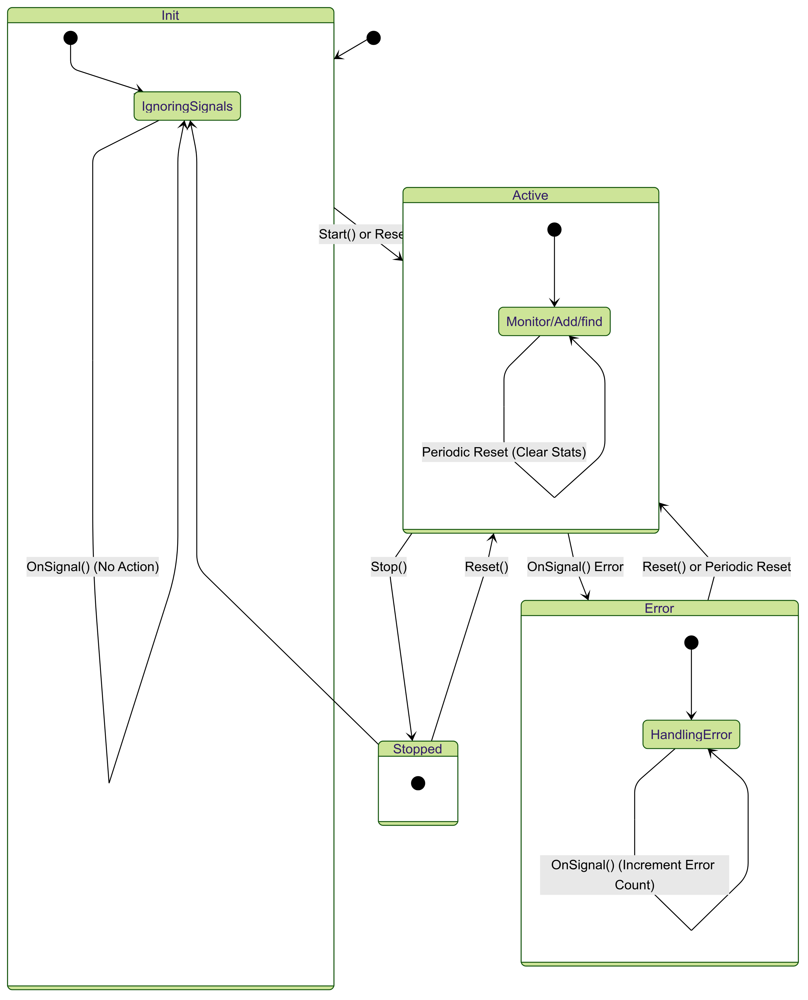
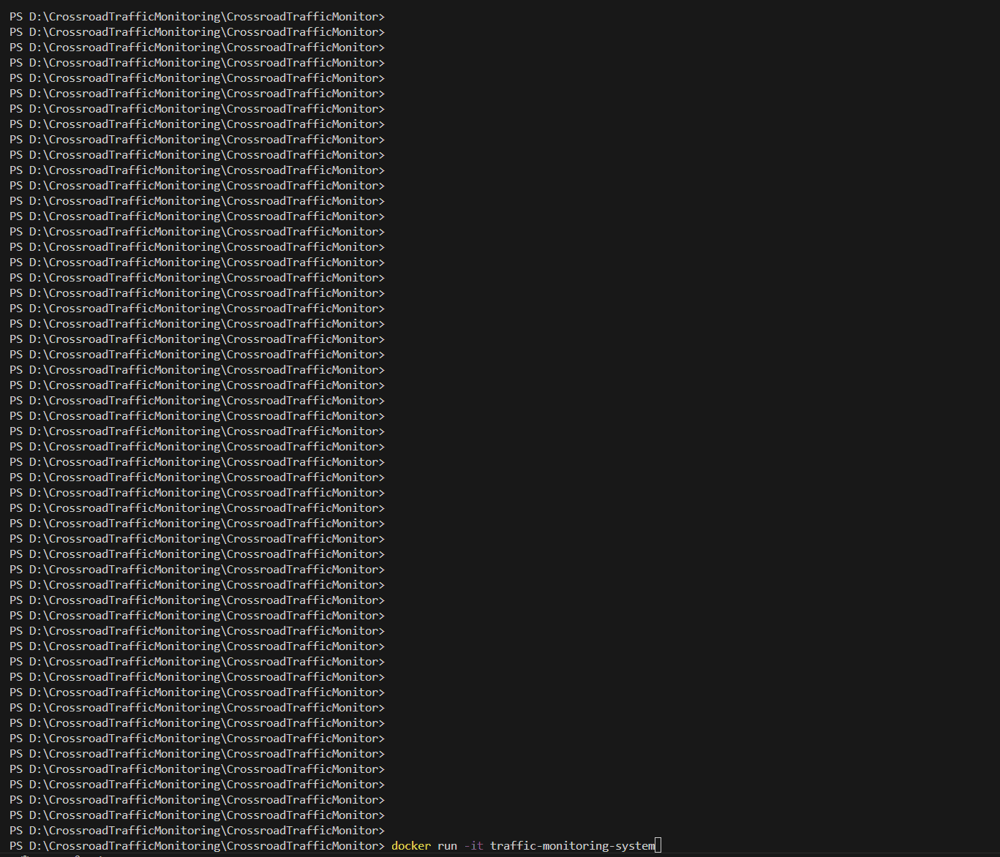
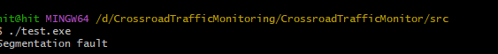
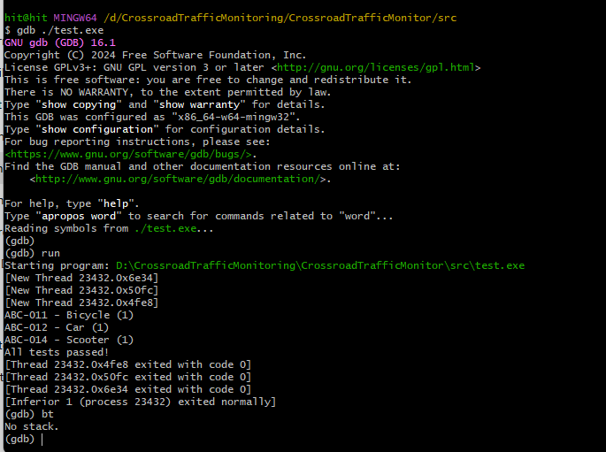

# CrossroadTrafficMonitor
A C++20 application designed to monitor vehicle traffic at a crossroad, optimizing for runtime efficiency and minimal memory fragmentation. This system categorizes vehicles, handles state transitions, and provides statistical reporting.

## Table of Contents
- [Problem Statement](#problem-statement)
- [Key Features](#key-features)
- [Design and Architecture](#design--architecture)
- [Project Structure](#project-structure)
- [Build Instructions](#build-instructions)
- [Using Docker](#docker)
- [Testing Strategy](#testing-strategy)
- [CI/CD Pipeline](#cicd-pipeline)
- [Demo and screenshots](#screenshots)
- [Challenges and solutions](#challenges--solutions)
- [Future Improvements](#future-improvements)

## Problem Statement
Aim to create a system that:
1. Handles up to 1000 unique vehicles across 3 categories (Bicycle, Car, Scooter).
2. Handle state transitions between Init, Active, Error and Stop states.
3. Register vehicle by ID, maintain a count of appearances and auto-reset after configurable period.
4. Provide alphabetical and per-category statistics.
5. Optimize for runtime efficiency and avoid memory fragmentation. 

## Key Features
- **Vehicle Tracking**: Unique ID tracking within categories
- **State Machine**: Robust state transitions with thread safety
- **Memory Efficient Storage**: 
  - Boost.Intrusive lists for O(1) insertions/removals
  - Pre-allocated vehicle pool
- **Statistical Reporting**: 
  - Category-specific counts 
  - Alphabetical sorting across all categories
  - Error signals count
- **Error Handling**: 
  - Camera error detection 
  - State recovery via Reset
- **Tests**: Google Test suite verifying state transitions, counting, error handling, and capacity edge cases.
- **Docker support**: Containerizes the environment to build, test, and run the interactive main.
- **CI/CD pipeline workflow**: compiles the application and checks in an integrated environment (open github actions from the status bar for detailed view)

## Design and Architecture

### Design
The application is designed to take in account  efficiency and reliability. The system operates as a state machine with four states: Init, Active, Error, and Stopped. This structure ensures control over signals—only the Active state processes vehicle signals, while Init and Stopped ignore inputs, and Error captures invalid operations.  Transitions between states are triggered by actions (e.g., Start(), Stop(), Reset()) or periodic timeouts.

To manage vehicle tracking without dynamic memory allocation, the system uses a pre-allocated pool of 1,000 Vehicle objects. Intrusive linked list, ensures O(1) allocation and deallocation. Vehicles are tracked using two Boost intrusive lists: category-specific lists (Bicycle, Car, Scooter) for fast per-type lookups and a global alphabetical list for ordered reporting. While alphabetical insertion uses linear search (O(n)), this trade-off was chosen for simplicity, given the 1,000-item limit.

Concurrency is managed through a mutex-guarded design, where all public methods are thread-safe via std::lock_guard. Alphabetical order is maintained during insertion, avoiding costly sorting at query time.


### State diagram


## Project Structure

| **Directory/File**                                | **Description**                                 |
|--------------------------------------------------|-------------------------------------------------|
| `CrossroadTrafficMonitoring/`                    | Project root directory                          |
| ├── `src/`                                       | Source code directory                           |
| │   ├── `CMakeLists.txt`                         | Build configuration for main application        |
| │   ├── `CrossroadTrafficMonitoring.cpp`         | Main logic                                      |
| │   ├── `CrossroadTrafficMonitoring.hpp`         | Main logic header                               |
| │   └── `interactive_main.cpp`                   | Demo CLI interface, enter auto-reset period here.  |
| │                                               | (currently 10 minutes auto reset)              |
| ├── `tests/`                                     | Unit and integration tests                      |
| │   ├── `CMakeLists.txt`                         | Test suite configuration                        |
| │   ├── `test_CrossroadTrafficMonitoring.cpp`    | Unit tests                                      |
| │   └── `test_main.cpp`                          | GoogleTest entry point                          |
| ├── `CMakeLists.txt`                             | Root build configuration                        |
| ├── `Dockerfile`                                 | Containerization setup                          |
| ├── `.github/`                                   | GitHub workflows directory                      |
| │   └── `workflows/`                             | Contains CI/CD pipeline configuration          |
| │       └── `ci.yaml`                            | CI/CD pipeline definition                       |
| └── `README.md`                                  | Project documentation                           |


## Build Instructions
This project is developed using MSYS2 (MinGW) and C++20, but it can also be built using any modern g++ compiler with Boost Intrusive Lists.
### Prequisites
- C++ 20 compiler: 
Ensure g++ is installed with:
```cpp
g++ --version
```
- Msys: If missing, install MinGW-w64 or MSYS2 (optinal)
- Boost Library: Install Boost library from the [official site](https://www.boost.org/). Extract it and note the directory path.

### Building the project - Manual compilation
If user wants to build without CMake, use the following g++ command:
```cpp
g++ -std=c++20 -I"D:/boost_1_87_0" -I"src" src/interactive_main.cpp src/CrossroadTrafficMonitoring.cpp -o interactive_main.exe -L"C:/msys64/mingw64/lib" -lpthread
```
flags can be used as desired: 
| Command Flags | Purpose |
|-------------|---------|
| `-std=c++20` | Enables C++20 standard |
| `-I"D:/boost_1_87_0"` | Includes Boost headers (location path) |
| `-I"src"` | Includes project source files |
| `src/interactive_main.cpp src/CrossroadTrafficMonitoring.cpp` | The source files to compile |
| `-o interactive_main.exe` | Output executable name |
| `-L"C:/msys64/mingw64/lib"` | Links necessary libraries (MinGW-w64 lib path) |
| `-lpthread` | Links the pthread library for thread safety |

Once compiled, run:
```cpp
./interactive_main.exe
```

### Building the project - Using CMake
```cpp
mkdir build
cd build
cmake ..
make -j$(nproc)
```
## Using Docker
If the user doesn’t want to worry about installing local dependencies, use Docker.
A Dockerfile is included in the repository. Build and run the application inside a container without installing Boost, CMake, or dependencies manually.

```cpp
Copy
Edit
docker build -t traffic_monitoring_system .
docker run --rm -it traffic_monitoring_system
```

## Testing Strategy
Google tes is used. Test cases include tests for:
- Initial State: Confirm system starts in Init.
- Start/Stop/Reset transitions.
- Empty Signal => transitions to Error.
- Signals in Error => increments errorCount only.
- Signals in Init or Stopped => ignored.
- Periodic Auto-Reset => automatically resets to Active after period.
- Vehicle Counting => ensures duplicates increment count, new IDs are added.
- Max Capacity Test

## CI/CD Pipeline
1. Build & Test: Installs dependencies and compiles; builds with coverage flags.
2. Memory Checks: Valgrind for leak detection and memory fragmentation check (using massif)
3. Coverage Reporting (Not stable)

## Demo and screenshots
A quick demo of the application running on Docker:


## Challenges and solutions

In developing the Crossroad Traffic Monitoring System, several challenges arose. Below are some of the key challenges faced during the implementation and how they were resolved:
1. Segmentation Fault During execution:
While running a test executable, a segmentation fault occurred, indicating an issue related to invalid memory access.

The root cause was accessing a dangling pointer after an element was removed from the intrusive list.
gdb was helpful in finding out the issue and resolving it: 


2. Free List Mismanagement
Another issue was that concurrent FreeVehicle() and AllocateVehicle() calls corrupted the free list’s linked structure. Issue identified was that without explicitly terminating the last node with `nullptr`, the free list became corrupted and was resolved with:
```cpp
vehiclePool[MAX_VEHICLES - 1].nextFree = nullptr;
```

3. Thread safety issues
Simultaneous access to vehicle data caused race conditions. The issue was found out with unit test
showing incorrect statistics upon using multiple onSignal(). Introduction of mutex locks for safe multithreading resolved the issue:
```cpp
std::lock_guard<std::mutex> lock(monitorMutex);
```

## Future Improvements
1. Faster lookups: Instead of linear search in category lists. we could use Boost.Instrusive Set for faster lookup. For 1000 vehicles linear search worked well (keeping in mind the overall code complexity).
2. Configuration File: Instead of hardcoding or passing the period in code, reading from config file (JSON/YAML) or env variable.
3. Responsive and better interactive menu: The interactive menu accepts exact case-sensitive input. It does not handle invalid inputs gracefully.
4. Database integration: right now system does not store historical data- everything resets when program restarts and statistics are lost after each session.
5. Enhance coverage: The repository has less test coverage (only checking critical functions), test coverage can be improved.